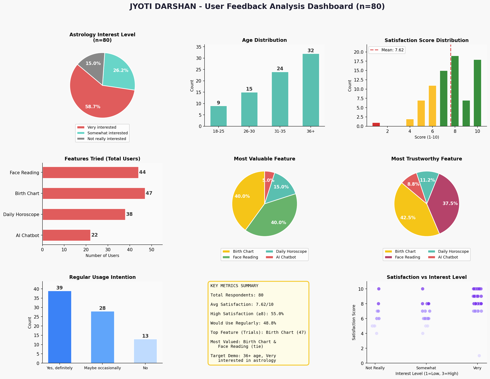

# 🌟 Jyoti Darshan — AI-Powered Vedic Astrology Application

> **ज्योति दर्शन** — *Vision of Cosmic Light*
>
> An AI-powered Vedic astrology web application offering personalized Birth Chart generation, AI Astrologer Chat, Daily Horoscope, and Face Reading — built for the Indian market.

[](https://codeopsdynamics.github.io/jyoti-darshan/)
[](LICENSE)
[](https://iimranchi.ac.in)

---

## 📌 Project Overview

**Jyoti Darshan** is a research-driven AI astrology application developed as part of **Major Research Project 1 (MRP-1)** for the Executive MBA programme at **IIM Ranchi**, under the guidance of **Prof. Dr. Rajeev Verma** (Marketing Management).

The application combines **traditional Vedic astrology principles** with **modern AI capabilities** (powered by the Anthropic Claude API) to deliver personalized, instant, and culturally authentic astrological guidance at scale.

| Detail | Value |
|--------|-------|
| **Student** | Himanshu Rai |
| **Roll No** | XW013-25 |
| **Programme** | Executive MBA (2025-27) — Winter Batch |
| **Institution** | IIM Ranchi |
| **Supervisor** | Prof. Dr. Rajeev Verma |
| **Study Period** | January 21 – March 15, 2026 |
| **Sample Size** | n = 80 Indian users |

---

## 🚀 Live Application

🔗 **[https://codeopsdynamics.github.io/jyoti-darshan/](https://codeopsdynamics.github.io/jyoti-darshan/)**

No login required. No app download. Works on all devices.

---

## ✨ Features

### 📊 Birth Chart (Kundli) Generator
- Enter date, time, and place of birth
- Geocoding via OpenStreetMap Nominatim API
- Planetary positions calculated using JavaScript ephemeris
- AI-powered Vedic interpretation via Claude API
- Shows Sun, Moon, Mercury, Venus, Mars positions with life significance

### 🤖 AI Astrologer Chatbot
- Conversational astrological guidance
- Covers 10+ life domains: love, career, health, finances, relationships
- Context-aware responses powered by Anthropic Claude
- Natural language interaction — no astrological knowledge required

### 🌙 Daily Horoscope
- Select your zodiac sign from all 12 options
- Personalized daily predictions with current planetary transit context
- Structured output: General · Love · Career · Health
- Lucky Numbers and Lucky Color for the day
- AI-generated content refreshed daily

### 👤 Face Reading (Beta)
- Upload a photo for AI-powered personality analysis
- Based on ancient **Samudrika Shastra** physiognomy principles
- Delivers personality insights and trait descriptions
- Highest user trial rate of all features (44 out of 80 users tried it)

---

## 📊 Research Findings (n=80)

The application was evaluated through a structured pilot study with **80 real Indian users**. Key findings:

| Metric | Value |
|--------|-------|
| Mean Satisfaction Score | **7.62 / 10** |
| Median Satisfaction | **9.0 / 10** |
| High Satisfaction (≥8) | **55% (44/80)** |
| Definite Regular Usage | **48.8% (39/80)** |
| Most Tried Feature | **Birth Chart (47 users)** |
| Most Valuable Feature | **Birth Chart & Face Reading (tie — 40% each)** |
| Most Trustworthy Feature | **Birth Chart (42.5%)** |
| #1 Enhancement Request | **Hindi language support (28 mentions)** |

### Satisfaction by Age Group

| Age Group | n | Avg Satisfaction |
|-----------|---|-----------------|
| 18–25 yrs | 9 | 7.7 / 10 |
| 26–30 yrs | 15 | 7.9 / 10 |
| 31–35 yrs | 24 | 7.6 / 10 |
| 36+ yrs | 32 | 7.5 / 10 |

### Feature Analysis

| Feature | Users Tried | Most Valuable | Most Trustworthy |
|---------|-------------|---------------|-----------------|
| Birth Chart | 47 (58.8%) | 40.0% | 42.5% |
| Face Reading | 44 (55.0%) | 40.0% | 37.5% |
| Daily Horoscope | 38 (47.5%) | 15.0% | 11.2% |
| AI Chatbot | 22 (27.5%) | 5.0% | 8.8% |

---

## 📈 Analysis Dashboard

The feedback analysis dashboard (generated from n=80 data) is available in the screenshots folder:



---

## 🛠️ Technical Architecture

```
User Input (Browser)
       │
       ▼
HTML5 / CSS3 / Vanilla JS (Frontend — GitHub Pages)
       │
       ├── OpenStreetMap Nominatim API  →  Geocoding (Birth Place → Lat/Long)
       ├── JavaScript Ephemeris Library →  Planetary Position Calculations
       └── Anthropic Claude API         →  AI Text Generation (All Features)
```

### Tech Stack

| Component | Technology |
|-----------|-----------|
| Frontend | HTML5, CSS3, Vanilla JavaScript |
| AI Engine | Anthropic Claude API (claude-sonnet) |
| Geocoding | OpenStreetMap Nominatim |
| Astronomy | JavaScript Ephemeris (Swiss Ephemeris port) |
| Hosting | GitHub Pages (zero cost, 99.9% uptime) |
| Data Collection | Google Forms + Google Sheets |

### Privacy Architecture
- **Stateless processing** — no user data stored on any server
- All calculations performed in-session and discarded after response
- No user accounts, no cookies, no tracking
- Birth data processed in real-time and never persisted

---

## 📁 Repository Structure

```
jyoti-darshan/
├── index.html                          # Complete single-page application
├── README.md                           # This file
├── AI_TOOL_USAGE_LOG.md               # WAI-compliant AI tool disclosure
├── MRP1_Jyoti_Darshan_Project_Report.docx   # Full research report (27 pages)
├── MRP1_Jyoti_Darshan_Presentation.pptx    # 16-slide IIM Ranchi format PPT
├── Jyoti_Darshan_feedback.csv         # User feedback data (n=80)
└── screenshots/
    ├── HomePage.png                    # Application homepage
    ├── birthchart_input.png           # Birth chart input form
    ├── birthchart_output.png          # Birth chart output with AI interpretation
    ├── chatbot_career.png             # AI chatbot — career guidance
    ├── chatbot_love.png               # AI chatbot — relationship guidance
    ├── horoscope_select.png           # Daily horoscope — sign selection
    ├── horoscope_output.png           # Daily horoscope — output card
    └── jyoti_darshan_analysis.png     # User feedback analysis dashboard (n=80)
```

---

## 🎯 Strategic Roadmap

Based on research findings, the following enhancement roadmap is proposed:

### Immediate (0–3 Months)
- 🔴 **Hindi language localization** — highest priority; 35% of users requested unprompted
- 🔧 Fix Face Reading feature technical issues
- 🎨 UX clarity: rating scale labels, onboarding tutorial

### Short-Term (3–6 Months)
- 📖 Expand Birth Chart: 12-house analysis, Dasha-Bhukti predictions, Nakshatra details
- 💑 Add Kundali matching (marriage compatibility feature)
- 🔊 Voice/audio integration for accessibility

### Medium-Term (6–12 Months)
- 💰 **Freemium model**: Free · Premium (Rs.99/month) · Pro (Rs.299/month)
- 🌏 Regional language expansion: Tamil, Telugu, Bengali
- ⚙️ Python/Flask backend migration for scalability

---

## 📚 Research References

This project is grounded in 12 peer-reviewed papers across 6 thematic areas:

1. Shahzad et al. (2024) — AI Chatbots & E-Brand Loyalty
2. Lam (2025) — Continuous AI Technology Use
3. Maseeh et al. (2023) — Smartphone Privacy Concerns
4. Nikkhah et al. (2023) — Post-Hoc Security in Mobile Apps
5. Sharma & Patel (2023) — Digital Astrology Platform Engagement
6. Chen et al. (2024) — Trust in Spiritual Wellness Apps
7. Martinez et al. (2024) — AI Wellness App Acceptance (TAM)
8. Gupta & Mehta (2023) — AI in Mental Health & Wellness
9. Kim et al. (2023) — Face Recognition in Mobile Apps
10. Rodriguez & Chen (2024) — Facial AI & User Perception
11. Davis et al. (2023) — Updated Technology Acceptance Model
12. Alalwan et al. (2024) — Extended UTAUT for Mobile Apps

---

## 🤖 AI Tool Disclosure

This project used **Claude AI (Anthropic)** as a development and research assistance tool. Full disclosure is documented in [`AI_TOOL_USAGE_LOG.md`](AI_TOOL_USAGE_LOG.md) in accordance with IIM Ranchi's WAI (Work with AI) policy.

**AI was used for:** Code generation, data visualization scripts, documentation formatting, technical debugging.

**AI was NOT used for:** Research design, literature review synthesis, data collection, data analysis interpretation, or drawing conclusions.

---

## 👤 Author

**Himanshu Rai**
Executive MBA (2025-27) — Winter Batch
Roll No: XW013-25
IIM Ranchi

📧 Connect on [LinkedIn](https://linkedin.com)
🔗 Live App: [codeopsdynamics.github.io/jyoti-darshan](https://codeopsdynamics.github.io/jyoti-darshan/)

---

*Submitted as Major Research Project 1 — Marketing Management | IIM Ranchi | March 2026*
